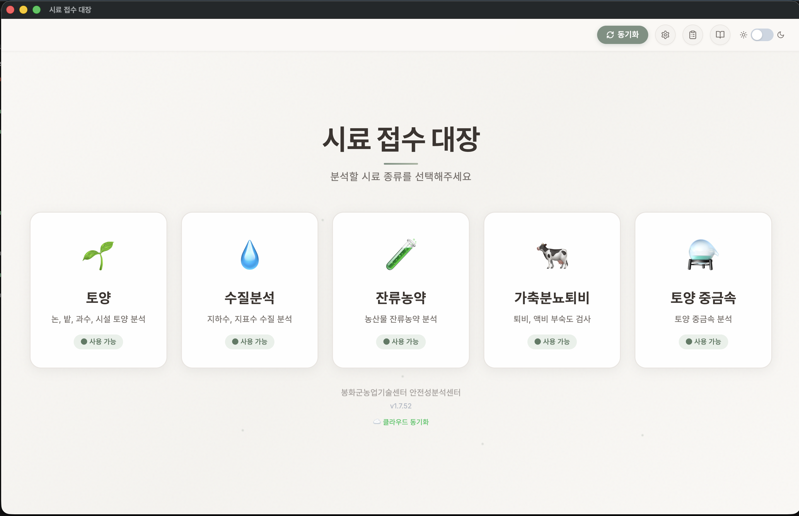

<!-- Parent: ../AGENTS.md -->
<!-- Generated: 2026-06-26 | Updated: 2026-06-26 -->

# manual (사용 설명서)

## Purpose
사용자 매뉴얼 페이지. 설치, 기본 사용법, Firebase 설정, 암호화, 데이터 마이그레이션, FAQ, 부록 등을 포함하는 종합 문서.

## Key Files
| File | Description |
|------|-------------|
| `index.html` | 사용 설명서 UI: 목차, 섹션별 가이드(1~A), FAQ, 스크린샷 이미지 참조 |
| `images/` | 스크린샷 디렉터리 (메인, 토양/수질/퇴액비/중금속/잔류농약 등록, 목록, 라벨 인쇄 등) |
| `screenshots/` | Firebase, 설정, 암호화 마이그레이션, 네트워크 제어 등 고급 기능 스크린샷 |
| `firebase-setup.html` | Firebase 설정 상세 가이드 (별도 페이지, 미사용 상태) |

## For AI Agents

### Working In This Directory

- **콘텐츠**: HTML 직접 작성 (마크다운 아님)
- **섹션**:
  1. 시스템 소개
  2. 설치 및 시작
  3. 기본 사용법
  4. Firebase 클라우드 설정
  5. 기관별 맞춤 설정
  6. 데이터 암호화
  7. 데이터 백업 및 복원
  8. FAQ (details/summary로 구현)
  9. 연락처 및 지원
  A. 부록
- **이미지 경로**: `images/`와 `screenshots/` 두 디렉터리 구분
- **스타일**: CSS-in-HTML (2500+줄), 목차 nav, 단계별 가이드 박스, info/warning/tip 박스
- **단계 스타일**:
  - `.step-list`: 배경 + border-left, ol/ul 포함
  - `.info-box` (파란색, ℹ️), `.warning-box` (빨간색, ⚠️), `.tip-box` (노란색, 💡)
- **테이블**: `.data-table` (스트라이프, hover)
- **특징 그리드**: `.feature-grid` (카드 레이아웃, 색상 상단 보더)

### Common Patterns

1. **단계별 가이드**:
   ```html
   <div class="step-list">
     <h4>제목</h4>
     <ol>
       <li><strong>항목명</strong>: 설명</li>
     </ol>
   </div>
   ```

2. **정보 박스**:
   ```html
   <div class="info-box">
     <h4>ℹ️ 제목</h4>
     <p>설명</p>
     <ul><li>항목</li></ul>
   </div>
   ```

3. **스크린샷 캡션**:
   ```html
   <div class="screenshot">
     
     <div class="screenshot-caption">메인 화면 설명</div>
   </div>
   ```

4. **FAQ 항목**:
   ```html
   <details class="faq-item">
     <summary>Q: 질문?</summary>
     <div class="faq-answer">
       <p>답변</p>
     </div>
   </details>
   ```

5. **특징 카드**:
   ```html
   <div class="feature-card [soil|water|pesticide|compost|heavy-metal]">
     <h4>📋 제목</h4>
     <p>설명</p>
   </div>
   ```

### Testing Requirements

- 렌더링: 모든 섹션 로드 및 레이아웃 확인
- 목차 링크: `<a href="#id">` 앵커 동작 확인
- 스크린샷: 이미지 경로 및 표시 확인 (images/, screenshots/)
- FAQ: details 열기/닫기 동작 확인
- 반응형: 모바일(≤768px), 태블릿, 데스크톱 레이아웃
- 인쇄: @media print 스타일 (그라디언트 제거, 링크 숨김 등)
- 접근성: 선택 가능한 텍스트, 스크린 리더 호환

```bash
# 해당 없음 (정적 HTML 페이지)
```

## Subdirectories

| Directory | Purpose |
|-----------|---------|
| `images/` | 기본 사용 예시 스크린샷 (메인, 등록, 목록 등) |
| `screenshots/` | 고급 기능 스크린샷 (Firebase, 설정, 암호화) |

## Dependencies
### Internal
- `window.location`: 메인 페이지로 이동 (../index.html)

### External
- Google Fonts (Noto Sans KR): Typography

<!-- MANUAL: 이 줄 아래 수동 작성 내용은 재생성 시 보존됩니다 -->
